# MCM 2023 Problem C - Wordle 数据分析与预测

> **2023 数学建模竞赛 (MCM) Problem C: Predicting Wordle Results**
> 
> 本项目提供完整的时间序列预测、单词属性分析和成绩分布预测解决方案。

[](https://www.python.org/)
[](LICENSE)

---

## 📁 项目结构（重构版 - 2025-12-16）

```
MCM_2023_C/
├── archives/                   # 竞赛题目归档
│   ├── 2023_MCM_Problem_C.pdf
│   └── descriptive_stats_report.txt
├── Q1/                         # Q1：报告人数时间序列预测与对比
│   ├── q1_final_clean.py       # 主程序：变点 + 滚动CV + SARIMA集成 + 90% CI
│   ├── model_comparison.py     # 统一口径对比：Ensemble vs Prophet vs Chronos
│   ├── viz_report.py           # 诊断/故事化图表与报告生成
│   └── results/                # 已生成的图表/报告/模型输出
│       ├── *_weekday_effects.png, *_changepoint.png, *_diagnostics.png  # 诊断图
│       ├── eda_*.png           # 探索性数据分析图（概览/季节性/波动/分解）
│       ├── explanation_report.txt, diagnostic_report.txt...  # 文本报告
│       └── ensemble_result.pkl # 模型结果
├── 单词属性/                   # Q2：属性-行为/难度分析（Hard Mode / avg guesses）
│   ├── enrich_features.py      # 为 data_with_features.xlsx 增加词频/词性等特征并导出 data_final.csv
│   ├── main.py                 # 主入口：依次运行 Hard Mode 分析、难度预测、热力图、EERIE示例预测
│   ├── data_loader.py          # 数据清洗、分布归一化、avg_guesses、共线性过滤等
│   ├── analysis_hard_mode.py   # Hard Mode 占比解释（OLS/Lasso/Lag对比）
│   ├── analysis_difficulty.py  # 难度建模（avg_guesses，多模型竞技场 + RF重要性 + KMeans分级）
│   ├── analysis_heatmap.py     # RQ1/RQ2 相关性热力图（莫兰迪配色）
│   ├── predict_eerie.py        # 多输出RF：预测指定单词的分布（若缺词则演示流程）
│   ├── model_mmoe.py           # MMoE 模型实现
│   ├── style_utils.py          # 可视化样式工具
│   ├── data_with_features.xlsx # 原始特征数据
│   ├── data_final.csv          # 增强后的最终数据
│   ├── analysis_report.txt     # 分析报告
│   └── heatmap_*.png           # RQ1/RQ2 相关性热力图（多种配色）
├── forcasting/                 # Q3：分布预测模型（MoE + Softmax）与基线
│   ├── Moe_Softmax.py          # MoE 分布预测主脚本（读取 data/mcm_processed_data.csv）
│   ├── Moe_Softmax_with_probability.py  # 带概率输出的 MoE 变体
│   ├── moe.py                  # MoE 结构（门控 + 多个MLP+Softmax专家）
│   ├── moe_tuning.py           # MoE 超参搜索/对比
│   ├── AutoEncoder.ipynb       # 自编码器实验
│   ├── moe_output/             # MoE 训练产物
│   │   ├── moe_softmax_pred_output.csv  # 预测结果
│   │   ├── moe_report.json, moe_summary_report.txt  # 报告
│   │   ├── moe_training_history.png, moe_distribution_comparison.png  # 训练图
│   │   └── moe_expert_*.png    # 专家分析图
│   └── explore/                # 额外：统一回归/分布基线模型库
│       ├── run_all_models.py   # 统一运行所有模型
│       ├── config.py           # 配置文件
│       ├── forecasting_models.py, distribution_models.py  # 模型库
│       ├── lasso_forcasting.py, ridge_forcasting.py...  # 各类模型脚本
│       └── *_results/          # 各模型结果目录
├── features/                   # 特征工程与仿真/强化学习生成脚本
│   ├── featureEngineering.ipynb  # 主特征工程 notebook
│   ├── addOn.ipynb             # 补充特征 notebook
│   ├── wordle_game_simulate.py # Wordle 策略仿真
│   ├── reinforcement_learning_wordle_game.py  # A2C 强化学习
│   └── feedbackEntropy.py      # 反馈熵计算
├── data/                       # 数据与中间产物
│   ├── mcm_processed_data.csv  # 核心特征数据（358条样本，55+特征）
│   ├── reduced_features_train.csv, reduced_features_test.csv  # 降维后特征
│   ├── lasso_feature_importance.xlsx, lasso_reduced_features_importance.xlsx  # 特征重要性
│   └── glove.6B/               # GloVe 词向量（大文件，默认被 gitignore）
├── models/                     # 训练得到的模型/降维器
│   ├── autoencoder_model.pkl   # 自编码器模型
│   ├── autoencoder_wordle_tf.keras  # TensorFlow Keras 模型
│   ├── reduction_models/       # 降维模型
│   └── wordle_a2c_ckpt/        # A2C 强化学习检查点
├── util/                       # 可视化工具
│   └── visualizations.py       # 统一可视化函数
├── featureEngineering.ipynb    # 根目录特征工程 notebook（备份）
├── AGENTS.md                   # 项目代理说明
└── requirements.txt            # Python 依赖
```

---

## 🚀 快速开始

### 环境设置

```bash
# 创建 conda 环境（推荐 Python 3.11）
conda create -n mcm2023 python=3.11 -y
conda activate mcm2023

# 安装依赖
pip install -r requirements.txt
```

### 一键运行

```bash
# 任务1：预测 2023-03-01 报告人数 + Hard Mode 分析
./run_task1.sh

# 任务2：预测 EERIE 的成绩分布
./run_task2.sh
```

**主要依赖库：**
- `numpy`, `pandas`, `matplotlib`, `seaborn`, `scipy` (数据处理与可视化)
- `statsmodels`, `scikit-learn` (统计模型与机器学习)
- `tensorflow` / `tensorflow-macos` (深度学习/自编码器，macOS 下自动选择)
- `torch` (深度学习/MoE模型)
- `ruptures`, `holidays` (变点检测与节假日处理)
- `nltk`, `wordfreq` (NLP特征提取)

---

## 🎯 题目要求与解决方案

| 题目要求 | 解决方案 | 实现文件 |
|---------|---------|---------|
| **Q1a**: 预测 2023-03-01 报告人数（含置信区间） | SARIMA 时间序列集成 + 变点检测 | `task1_reporting_volume/q1_final_clean.py` |
| **Q1b**: 分析单词属性对 Hard Mode 的影响 | OLS + Lasso + 滞后特征分析 | `task1_reporting_volume/analysis_hard_mode.py` |
| **Q2**: 预测 EERIE 的 1-7 次猜中分布 | Random Forest（79特征） | `task2_distribution_prediction/predict_eerie.py` |

---

## 🔬 核心技术方案

### 📊 任务1：时间序列预测（报告人数）

**关键发现**：
- 🔴 **变点检测**：2022-10-05 出现结构性断裂，报告人数从 11.2万/天 → 2.6万/天（下降 77.1%）
- 📈 **预测结果**：2023-03-01 点预测 **20,181 人**，90% CI: [11,646, 34,971]
- 📊 **模型性能**：
  - CV覆盖率: 97.8% (理想: 95%)
  - Walk-Forward h=60天覆盖率: **97.9%** (目标: ~90%)
  - Walk-Forward h=30天覆盖率: **96.7%**

**技术栈**：
```python
✓ 变点检测 (PELT)          # 在log空间检测趋势突变
✓ SARIMA(1,1,2)x(1,0,1,7)  # 捕捉周周期性（7天）
✓ 滚动交叉验证              # 避免数据泄露
✓ 集成学习 (IVW)           # 逆方差加权
✓ 全概率方差公式            # Law of Total Variance（预测区间）
✓ Duan Smearing            # 对数回变换修正
✓ 单词属性特征              # lag0 + lag1 共10个特征
```

**输出文件**：
- `results/task1/explanation_report.txt` - 解释性报告
- `results/task1/diagnostic_report.txt` - 模型诊断
- `pictures/task1/1_weekday_effects.png` - 工作日效应
- `pictures/task1/2_changepoint.png` - 变点可视化
- `pictures/task1/3_diagnostics.png` - 残差诊断

### 🎯 任务1（改进版）：时间序列预测 + 单词属性特征

**核心改进**（2025-12-17 最新）：
- 🆕 **添加当天单词属性**（lag0_*）：5个特征
  - `lag0_mean_simulate_freq` - 当天单词模拟平均尝试次数
  - `lag0_letter_entropy` - 当天单词字母熵
  - `lag0_mean_simulate_random` - 当天单词随机策略尝试次数
  - `lag0_has_common_suffix` - 当天单词是否有常见后缀
  - `lag0_letter_freq_mean` - 当天单词字母平均频率
  
- 🆕 **添加前一天单词属性**（lag1_*）：5个特征
  - `lag1_mean_simulate_freq` - 前一天单词模拟平均尝试次数
  - `lag1_letter_entropy` - 前一天单词字母熵
  - `lag1_mean_simulate_random` - 前一天单词随机策略尝试次数
  - `lag1_has_common_suffix` - 前一天单词是否有常见后缀
  - `lag1_letter_freq_mean` - 前一天单词字母平均频率
  
- 🔧 **特征集扩展**：原 3 个 → 现 13 个
  - 基础特征: `regime`, `is_weekend`, `is_holiday`
  - 当天单词: 5个 lag0_* 特征（贡献 31.2%）
  - 前一天单词: 5个 lag1_* 特征（贡献 22.7%）

- 🐛 **关键Bug修复**：
  - ✅ 修复 regime 特征在测试集中的设置逻辑（基于绝对位置）
  - ✅ 修复 ensemble 方差合并公式（从估计量方差→预测方差）
  - ✅ 使用全概率公式: `Var(Y) = E[Var(Y|Model)] + Var[E(Y|Model)]`
  - ✅ Walk-Forward 覆盖率从 **68.3% → 97.9%** ⭐

**Hard Mode 影响因素**：
- 📌 **滞后效应占主导**：前2-3天的 Hard Mode 比例贡献 **98%+ 重要性**
- 🔤 **单词属性影响微弱**：OLS R² = 0.23，Lasso 仅保留 20/79 特征

**输出文件**：
- `pictures/task1/Feature_Importance_Hard_Mode_Ratio_Lag_vs_Attributes.png`

### 🎲 任务2：成绩分布预测（EERIE）

**项目结构调整**：
- 🔬 **`feature_engineering/`**：独立的特征工程模块（包含 AutoEncoder 降维）
- 📂 **`experiments/`**：探索性分析（Lasso, XGBoost, MLP 等实验）
- ⭐ **`models/`**：实际解决方案（Random Forest 训练脚本）

**数据驱动**：
- 📊 **训练数据**：358 个单词 × 79 个特征（来自 `feature_engineering/`）
- 🎯 **预测目标**：7 个类别（1-6 tries + 7+ tries）

**特征工程**（79 维）：
```
字母结构: num_rare_letters, has_double_letter, max_consecutive_vowels...
词频: Zipf-value, letter_freq_mean, positional_freq_mean...
熵: letter_entropy, feedback_entropy, position_self_entropy...
语义: semantic_distance, semantic_neighbors_count...
模拟: *_simulate_random, *_simulate_freq (来自 wordle_game_simulate.py)
强化学习: rl_*_try_* (来自 reinforcement_learning_wordle_game.py)
降维: autoencoder_value (来自 AutoEncoder.ipynb)
```

**模型选择**：Random Forest（基于实验对比选出）

**输出文件**：
- `results/task2/eerie_prediction.csv` - EERIE 预测结果
- `pictures/task2/eerie_distribution.png` - 分布对比图

---

## 📊 数据说明

### ⭐ 核心数据：`data/mcm_processed_data.csv`

| 类型 | 列数 | 说明 |
|-----|-----|------|
| 基础信息 | 3 | `date`, `word`, `contest_number` |
| 报告人数 | 2 | `number_of_reported_results`, `number_in_hard_mode` |
| 真实分布 | 7 | `1_try` ~ `7_or_more_tries_x` |
| 单词特征 | 79 | 字母结构、词频、熵、语义、仿真、RL... |

**⚠️ 重要**：
- ✅ **CSV 文件**包含真实报告人数（几万人规模）
- ❌ **Excel 文件**（`backups/2023_MCM_Problem_C_Data.xlsx`）是归一化的百分比数据（0-100）

---

## 🛠️ 技术栈

### 核心依赖

```python
pandas>=2.0.0         # 数据处理
numpy>=1.24.0         # 数值计算
matplotlib>=3.7.0     # 绘图
seaborn>=0.12.0       # 统计可视化
scikit-learn>=1.3.0   # 机器学习
statsmodels>=0.14.0   # 统计模型（SARIMA）
ruptures>=1.1.0       # 变点检测
holidays>=0.34        # 节假日数据
wordfreq>=3.0         # 词频统计
nltk>=3.8             # NLP 工具
```

### 可选依赖

```python
torch>=2.0.0          # 深度学习（用于 MoE 实验）
xgboost>=2.0.0        # 梯度提升（用于对比实验）
```

---

## 📖 详细使用说明

### 任务1：报告人数预测

```bash
# 方法1：使用 shell 脚本（推荐）
./run_task1.sh

# 方法2：直接运行 Python
cd task1_reporting_volume
conda run -n mcm2023 python run_task1.py
```

输出位于 `forcasting/moe_output/`：
- **[预测结果]** `moe_softmax_pred_output.csv`, `moe_expert_distribution_summary_test.csv`
- **[报告]** `moe_report.json`, `moe_summary_report.txt`
- **[可视化]** `moe_training_history.png`, `moe_distribution_comparison.png`, `moe_error_analysis.png`
- **[专家分析]** `moe_expert_usage.png`, `moe_expert_mean_distribution_test.png`, `moe_expert_sample_ratio_test.png`
- **[综合报告]** `moe_comprehensive_summary.png`, `moe_performance_metrics.png`, `moe_aux_loss.png`

3. **模型文件**（`results/task1/`）：
   - `ensemble_result.pkl` - 集成模型（可用于后续预测）

### 任务2：EERIE 分布预测

```bash
# 方法1：使用 shell 脚本（推荐）
./run_task2.sh

# 方法2：直接运行 Python
cd task2_distribution_prediction
conda run -n mcm2023 python predict_eerie.py
```

**输出详情**：
1. **预测结果**（`results/task2/`）：
   - `eerie_prediction.csv` - EERIE 的 1-7 次分布概率
   
2. **可视化图表**（`pictures/task2/`）：
   - `eerie_distribution.png` - 预测分布 vs 平均分布对比

---

## 🔍 项目亮点

### ✨ 方法创新

1. **变点检测 + 分段建模**
   - 使用 PELT 算法自动检测时间序列的结构性变化
   - 避免数据泄露：滚动 CV 中每一折独立检测变点

2. **集成学习策略**
   - 多个 SARIMA 模型通过逆方差加权集成
   - 在 log 空间合并预测区间，提高覆盖率准确性

3. **惯性效应发现**
   - Hard Mode 使用具有强时间惯性（滞后效应占 98%+）
   - 单词属性对当天 Hard Mode 比例影响微弱

### 📊 数据工程

1. **特征工程完善**
   - 79 维单词特征涵盖字母、词频、熵、语义、仿真、RL
   - 自动化特征计算流程

2. **数据质量保障**
   - 识别并修复 Excel 归一化数据问题
   - 使用 CSV 真实数据进行建模

### 🎯 可解释性

1. **自动报告生成**
   - 变点位置、原因分析
   - 周末效应、节假日效应量化
   - 模型性能诊断（残差、覆盖率）

2. **可视化完整**
   - 每个分析步骤都有对应图表
   - 图表风格统一，信息清晰

---

## 📝 重要说明

### ⚠️ 数据格式警告

- **Excel 文件**（`backups/2023_MCM_Problem_C_Data.xlsx`）：
  - 包含的是**归一化的百分比数据**（0-100）
  - **不是**真实的报告人数
  - 主要用于特征列的获取

- **CSV 文件**（`data/mcm_processed_data.csv`）：
  - 包含**真实的报告人数**（几万人规模）
  - 包含完整的 79 维单词特征
  - **所有建模都基于此文件**

### 📂 文件组织

- **结果文件**统一存放在 `results/task1/` 和 `results/task2/`
- **图表文件**统一存放在 `pictures/task1/` 和 `pictures/task2/`
- **不再有**子文件夹下的重复 `results/` 目录

---

## 🤝 贡献

欢迎提交 Issue 和 Pull Request！

---

## 📄 License

MIT License

---

## 📧 联系方式

如有问题，请通过 GitHub Issues 联系。

---

**最后更新**: 2025-12-17  
**项目状态**: ✅ 生产就绪

---
*Created for 2023 MCM Problem C Solution.*

# 附录

```mermaid
graph LR
    %% 定义样式
    classDef input fill:#E3F2FD,stroke:#1565C0,stroke-width:2px;
    classDef layer fill:#FFECB3,stroke:#FF6F00,stroke-width:2px,rounded;
    classDef gateBlock fill:#C8E6C9,stroke:#2E7D32,stroke-width:2px;
    classDef expertBlock fill:#F8BBD0,stroke:#C2185B,stroke-width:2px;
    classDef operation fill:#E1BEE7,stroke:#6A1B9A,stroke-width:1px,stroke-dasharray: 5 5;
    classDef output fill:#FFF9C4,stroke:#FBC02D,stroke-width:2px;
    classDef loss fill:#FFCDD2,stroke:#D32F2F,stroke-width:2px;

    %% 输入层
    Input[输入特征 Input Tensor]:::input -->|"形状: (Batch, 55)"| SplitPoint((分流点));

    %% 分流
    SplitPoint --> GatingNetwork;
    SplitPoint --> Dispatcher;

    %% --- 门控网络 (Gating Network) ---
    subgraph Gating_Mechanism ["门控机制 (Noisy Top-K Gating)"]
        direction TB
        GatingNetwork["门控线性层 (Linear)"]:::gateBlock;
        Noise["添加噪声 (训练时)"]:::operation;
        SoftmaxGate["Softmax Activation"]:::gateBlock;
        TopK["Top-K Selection (k=1) & Normalize"]:::gateBlock;

        GatingNetwork --"Logits (Batch, 2)"--> Noise --> SoftmaxGate --> TopK;
        
        %% 辅助损失路径
        TopK -.->|"专家负载统计"| AuxLoss["辅助损失 (负载均衡)"]:::loss;
    end

    TopK --"稀疏门控权重 Gates\n(Batch, 2, 仅1个非零)"--> Dispatcher;
    TopK --"门控权重用于加权"--> Combiner;

    %% --- 路由与专家层 ---
    Dispatcher["稀疏调度器 (Sparse Dispatcher)\n根据Gates路由样本"]:::operation;

    subgraph Mixture_of_Experts ["混合专家层 (Mixture of Experts)"]
        direction TB
        
        %% 专家 1
        subgraph Expert_0 ["专家 0 (MLP)"]
            direction LR
            E0_L1["Linear (55→64)"]:::layer --> E0_ReLU["ReLU"]:::layer --> E0_L2["Linear (64→7)"]:::layer --> E0_Softmax["Softmax"]:::layer;
        end
        
        %% 专家 2
        subgraph Expert_1 ["专家 1 (MLP)"]
            direction LR
            E1_L1["Linear (55→64)"]:::layer --> E1_ReLU["ReLU"]:::layer --> E1_L2["Linear (64→7)"]:::layer --> E1_Softmax["Softmax"]:::layer;
        end
    end

    %% 路由连接
    Dispatcher --"路由样本子集 0"--> E0_L1;
    Dispatcher --"路由样本子集 1"--> E1_L1;

    %% 专家输出
    E0_Softmax --"专家0输出 (Sub-Batch, 7)"--> Combiner;
    E1_Softmax --"专家1输出 (Sub-Batch, 7)"--> Combiner;

    %% --- 聚合与输出 ---
    Combiner["加权组合 (Weighted Combination)\n∑ (Gate_i * Expert_i_Output)"]:::operation;
    
    Combiner --> FinalOutput["最终预测输出\n(概率分布)"]:::output;

    %% 最终输出标注
    FinalOutput --"形状: (Batch, 7)\nSum=1"--> End((结束));
    AuxLoss -.->|"加入总损失"| End;

    %% 注释
    note[/"注：由于 k=1，对于每个样本，\n门控实际上是选择一个专家，\n组合阶段通过门控权重(接近1)传递该专家的输出。"/]:::operation
    TopK -.-> note
```


